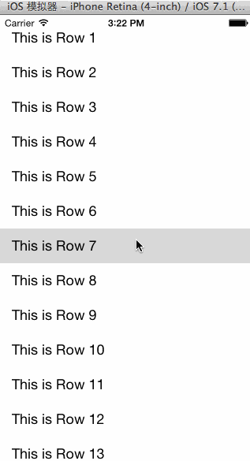

CLParallax
==========

CLParallax is a open source library for a parallaxed effect with view and scroll view

####ScreenShot
</img>

####Usage
    CLParallaxView *parallaxView = [[CLParallaxView alloc] initWithFrame:self.view.bounds];
    [self.view addSubview:parallaxView];
    [parallaxView configWithParallaxContentView:imageView rootView:tableView parallaxHeight:200];

or

    CLParallaxViewController *parallaxController = [[CLParallaxViewController alloc] init];
    [parallaxController willMoveToParentViewController:self];
    [self addChildViewController:parallaxController];
    parallaxController.view.frame = self.view.bounds;
    [self.view addSubview:parallaxController.view];
    [parallaxController didMoveToParentViewController:self];

    [parallaxController configWithParallaxContentView:imageView rootView:tableView parallaxHeight:200];